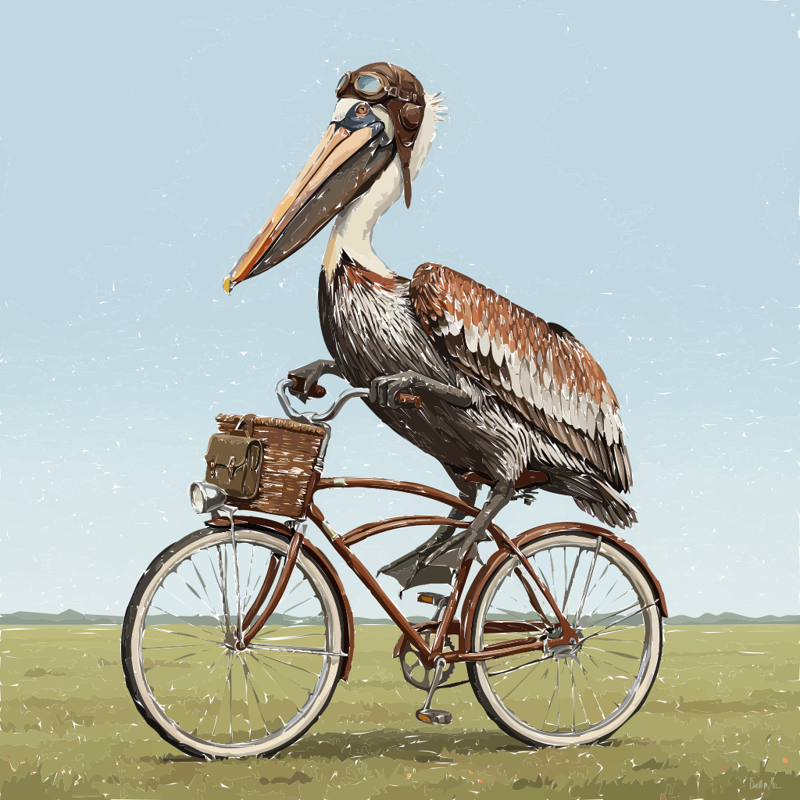
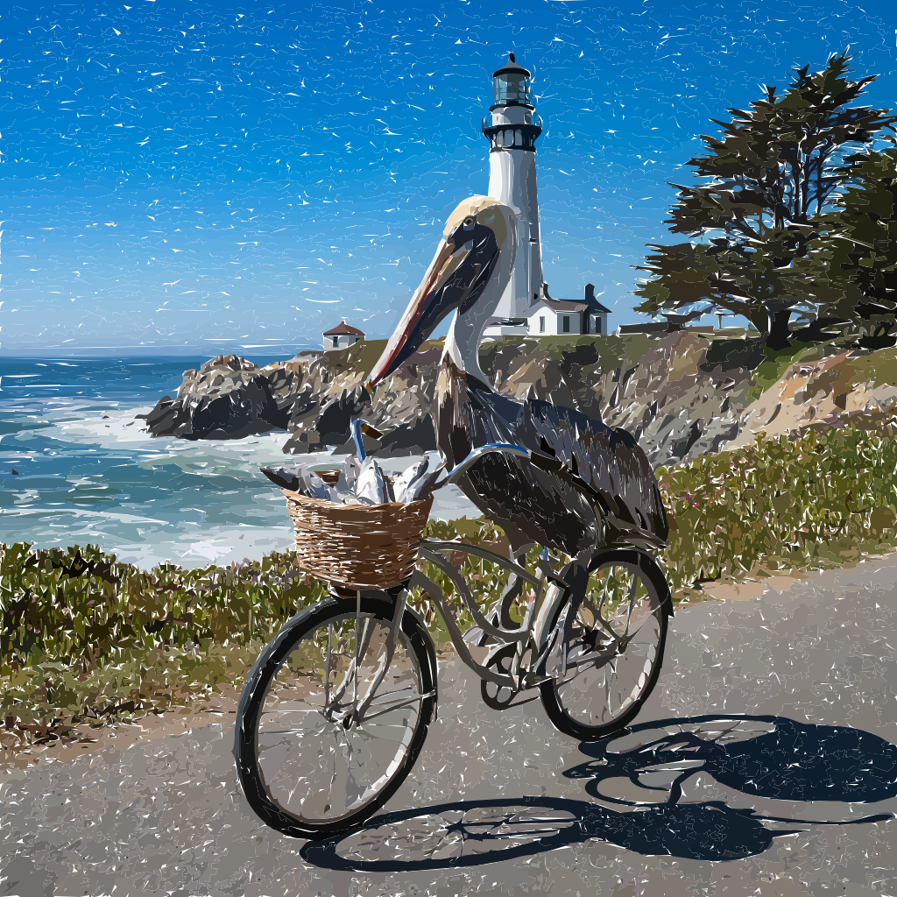
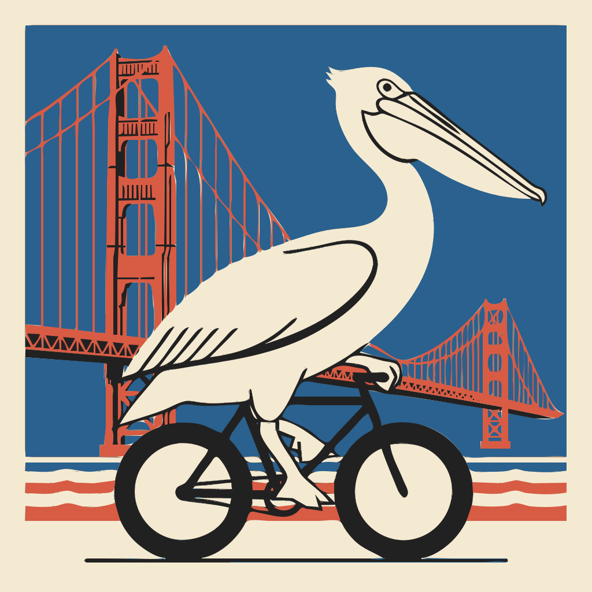

## Pelican Rides a Bicycle

Spoiler alert! This is what happens when you ask Claude-Code to draw an SVG of a pelican riding a bicycle:



This repo combines two simple ideas in Claude-Code to accomplish an otherwise difficult LLM task:

1. Computational irreducibility from this [2023 Stephen Wolfram essay](https://writings.stephenwolfram.com/2023/02/what-is-chatgpt-doing-and-why-does-it-work/#surely-a-network-thats-big-enough-can-do-anything)
2. Tool invocation

Wolfram writes:

> So how is it, then, that something like ChatGPT can get as far as it does with language? The basic answer, I think, is that language is at a fundamental level somehow simpler than it seems. And this means that ChatGPT—even with its ultimately straightforward neural net structure—is successfully able to “capture the essence” of human language and the thinking behind it. And moreover, in its training, ChatGPT has somehow “implicitly discovered” whatever regularities in language (and thinking) make this possible.

The essay, and especially that section, suggests that maybe LLMs are a front-end language processor for what human(oid)s want to accomplish, but for a generally intelligent machine it's not enough.

The idea here is that tools and agents are a partial way forward: if we combined them in clever ways we can make new gains on currently unsolvable problems. (Even agents are probably a partial solution. There is so much work ahead! E.g. if we solve spatial intelligence, will it be enough? It feels like intelligence is motivated by [physical reality](https://josevillegas.substack.com/p/plato-aristotle-and-chatgpt): even if we solve the [grasping problem](https://arxiv.org/abs/1806.09266) generally, will the machine know what every human child knows: don't grasp a cup covered in thorns?)

## Setup

This repo uses [Docker](https://formulae.brew.sh/formula/docker), [Container-Use](https://container-use.com/), Claude-Code [agent-skills](https://code.claude.com/docs/en/skills#agent-skills) and Claude-Code [sandboxing](https://code.claude.com/docs/en/sandboxing#sandboxing). These instructions are for macOS because that is the only system I can verify. Linux and Windows installs will be similar and easy to figure out.

### Docker

The way we install Docker:

```
brew install docker
```

### Git

```
mkdir pelican-rides-a-bicycle
cd  pelican-rides-a-bicycle
git init
```

### Claude-Code

#### Sandboxing

To enable Claude-Code [sandboxing](https://code.claude.com/docs/en/sandboxing) we added `settings.json` with the following content:

```
{
"env": {
"INHERIT_FROM_SHELL": "true",
"GEMINI_API_KEY": "${GEMINI_API_KEY}"
},
"sandbox": {
"enabled": true,
}
}
```

#### Agent-Skills

This is how we setup our SVG-drawing skill:

```
mkdir -p .claude/skills/draw-svg
```

### Container-Use

[Container-Use](https://container-use.com/quickstart), from Docker creator Solomon Hykes, allows you to isolate and sandbox your work so that gen/ai doesn't mess with your computer directly. It also allows you to run multiple experiments in parallel and merge back the results you want to keep. We set it up using the following instructions:

```
brew install dagger/tap/container-use
```

Here we add the Container-Use MCP server to Claude-Code.

```
claude mcp add  --scope project container-use -- container-use stdio
```

Here we update the Claude-Code context to include instructions that make Container-Use more effective.

```
curl https://raw.githubusercontent.com/dagger/container-use/main/rules/agent.md >> CLAUDE.md
```

Now we need to setup the Gemini API key:

```
container-use config env set GEMINI_API_KEY <the key value>
```

This is how we invoke Claude-Code to prompt us before it executes certain Container-Use operations. (Don't worry, it will ask you at the prompt how to handle these operations going forward if you find this too onerous. The general idea is that you should not let a gen/ai run wild when it has potential access to untrusted inputs.)

```
claude --allowedTools mcp__container-use__environment_checkpoint,mcp__container-use__environment_create,mcp__container-use__environment_add_service,mcp__container-use__environment_file_delete,mcp__container-use__environment_file_list,mcp__container-use__environment_file_read,mcp__container-use__environment_file_write,mcp__container-use__environment_open,mcp__container-use__environment_run_cmd,mcp__container-use__environment_update
```

## Do the Thing!

Start Claude-Code (using container-use mcp restrictions):

```
claude --allowedTools mcp__container-use__environment_checkpoint,mcp__container-use__environment_create,mcp__container-use__environment_add_service,mcp__container-use__environment_file_delete,mcp__container-use__environment_file_list,mcp__container-use__environment_file_read,mcp__container-use__environment_file_write,mcp__container-use__environment_open,mcp__container-use__environment_run_cmd,mcp__container-use__environment_update
```

At the prompt type:

> Generate an SVG of a pelican riding a bicycle.

## Some More Fun

### Near Pelican Point

> Generate an SVG of a pelican riding a bicycle with a basket of fish and no helmet during the day in half moon bay near pigeon point lighthouse. Make it photorealistic and accurate to the half moon bay area.



### GGNP Poster

> Generate an svg of a pelican riding a bicycle with a design similar to the golden gate national parks poster from the mid 90s. make sure the sky is blue, the bridge is red and pelican stands out.

