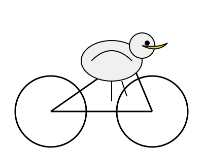

## Pelican Rides a Bicycle

> [!NOTE]
> This is what happens when you ask Claude-Code to generate an SVG of a pelican riding a bicycle!


## Claude Code Skill

LLMs typically produce broken SVGs for complex spatial tasks—overlapping 
geometry, impossible proportions, physically implausible compositions. This 
happens because LLMs predict tokens but don't *compute* spatial relationships.

We can see this when we ask Claude Sonnet to generate this SVG directly:



### Underlying Idea

This repo combines simple ideas in a Claude-Code skill to accomplish an otherwise difficult LLM task:

1. Natural language understanding (Claude Code)
2. Image generation capability (Google Gemini)
3. Tool invocation to handle computational irreducibility (from this [2023 Stephen Wolfram essay](https://writings.stephenwolfram.com/2023/02/what-is-chatgpt-doing-and-why-does-it-work/#surely-a-network-thats-big-enough-can-do-anything))

This demonstrates that tool-augmented AI can tackle computationally irreducible problems like spatial intelligence via iterative computation (vectoring tracing), not just pattern matching (LLM/transformer).

Wolfram writes:

> Yes, we could memorize lots of specific examples of what happens in  some particular computational system. And maybe we could even see some  (“computationally reducible”) patterns that would allow us to do a  little generalization. But the point is that computational  irreducibility means that we can never guarantee that the unexpected  won’t happen—and it’s only by explicitly doing the computation that you  can tell what actually happens in any particular case.
>
> And in the end there’s just a fundamental tension between  learnability and computational irreducibility. Learning involves in  effect [compressing data by leveraging regularities](https://www.wolframscience.com/nks/chap-10--processes-of-perception-and-analysis/). But computational irreducibility implies that ultimately there’s a limit to what regularities there may be.

The essay, and especially that section, suggests that transformers are good language processors, but for a generally intelligent machine it's not enough. Perhaps tools and agents are a partial way forward: if we combined them in clever ways we can make new gains on currently unsolvable problems.

## Prerequisites

### Install the Following

- [Install Docker](https://docs.docker.com/engine/install/)
- [Install Claude Code](https://code.claude.com/docs/en/setup)
- [Install Container-Use](https://container-use.com/quickstart)
- [Generate a Gemini API key](https://ai.google.dev/gemini-api/docs/api-key)

### Google Gemini Config

Configure the Gemini API key in Container-Use:

```
container-use config env set GEMINI_API_KEY <the key value>
```

### About Container-Use

[Container-Use](https://container-use.com/quickstart) is from Docker creator Solomon Hykes. It allows you to isolate and sandbox your work so that gen/AI doesn't mess with your computer directly. It also allows you to run multiple experiments in parallel and merge back the results you want to keep.


## Quick Start

To try the skill for yourself, you can simply clone this repo and run Claude Code in the cloned directory.

```bash
git clone https://github.com/0x6a77/pelican-rides-a-bicycle

cd pelican-rides-a-bicycle

claude --allowedTools mcp__container-use__environment_checkpoint,mcp__container-use__environment_create,mcp__container-use__environment_add_service,mcp__container-use__environment_file_delete,mcp__container-use__environment_file_list,mcp__container-use__environment_file_read,mcp__container-use__environment_file_write,mcp__container-use__environment_open,mcp__container-use__environment_run_cmd,mcp__container-use__environment_update
```

> [!NOTE]
> [This page](https://container-use.com/quickstart#:~:text=Trust%20Only%20Container%20Use%20Tools%20(Optional)) explains why `container-use` uses the `--allowedTools` argument.

Then at the prompt, type `Generate an SVG of a pelican riding a bicycle`

## How It Works

When you prompt "Generate an SVG of a pelican riding a bicycle":

1. Claude Code interprets your natural language request
2. Gemini generates an initial image based on the prompt
3. Autotrace converts the bitmap to SVG through the iterative path fitting optimization process that fits Bezier curves to pixel data
4. Save the final SVG

The path fitting step is where computational irreducibility matters most:  there's no way to predict optimal SVG paths without actually running the  iterative curve-fitting algorithm. Gemini provides the spatial intelligence  (trained on spatially correct images to understand what a "pelican on a  bicycle" looks like), while autotrace handles the computational optimization  (fitting precise Bezier curves to the bitmap pixels).

This multi-step approach solves what single-model LLMs cannot: generating geometrically valid, visually accurate SVGs for complex spatial prompts.

## How to Build This Skill

If you want to build the skill from scratch, then follow these instructions.

The setup uses Docker, [Container-Use](https://container-use.com/), Claude-Code [agent-skills](https://code.claude.com/docs/en/skills#agent-skills) and Claude-Code [sandboxing](https://code.claude.com/docs/en/sandboxing#sandboxing). Only the installation of Docker is platform dependent, this skill will work consistently on MacOS, Windows and Linux due to the use of `container-use` which not only sandboxes Claude Code from your local machine, it standardizes on Linux to run.

### Sandboxing

To enable Claude-Code [sandboxing](https://code.claude.com/docs/en/sandboxing) we added `.claude/settings.json` with the following content:

```
{
  "env": {
    "INHERIT_FROM_SHELL": "true",
  },
  "sandbox": {
    "enabled": true
  }
}
```

### Agent-Skills

To create the `create-svg-from-prompt` add the following to `.claude/skills/create-svg-from-prompt/SKILL.md`:

````text
---
name: create-svg-from-prompt
description: Generate an SVG of a user-requested image or scene
---

## Setup

if `autotrace` is not available in the environment, then install it with the following command:

```bash
sudo apt update
sudo apt install git build-essential intltool imagemagick libmagickcore-dev pstoedit libpstoedit-dev autopoint
git clone https://github.com/autotrace/autotrace.git
cd autotrace
./autogen.sh
LD_LIBRARY_PATH=/usr/local/lib ./configure --prefix=/usr
make
sudo make install
```

## Core Workflow

When the user prompts the model to generate an SVG of and image or scene:

### User wants an SVG of an image or scene

To generate an SVG of an image or scene use Google Gemini and autotrace:

```bash
curl -s -X POST "https://generativelanguage.googleapis.com/v1beta/models/gemini-2.5-flash-image:generateContent" -H "x-goog-api-key: <GEMINI_API_KEY>" -H "Content-Type: application/json" -d '{ "contents": [{ "parts": [ {"text": "<IMAGE_PROMPT>"}]}]}' | grep -o '"data": "[^"]*"' | cut -d'"' -f4 | base64 --decode | autotrace -output-format svg -despeckle-level 10 -despeckle-tightness 2.0 -output-file <OUTPUT_FILE>.svg
```

**Arguments from prompt:**
- `<GEMINI_API_KEY>`: The Gemini API key gotten from the environment variable "GEMINI_API_KEY"
- `<IMAGE_PROMPT>`: The user's initial prompt modified to change phrases like "Generate an svg" to "Generate an image." Do not modify the rest of the prompt or add any extra instructions or descriptions.
- `<OUTPUT_FILE>`: An 8-30 character filename based on the image the user wants

````

> [!NOTE]
> This skill passes the Gemini API key to curl via an environment variable setup in the `container-use` configs setup above.

### Run It!

Invoke Claude-Code with Container-Use protections. (Container-Use will prompt you to verify each operation before execution,  preventing unintended actions by the AI agent.)

```
claude --allowedTools mcp__container-use__environment_checkpoint,mcp__container-use__environment_create,mcp__container-use__environment_add_service,mcp__container-use__environment_file_delete,mcp__container-use__environment_file_list,mcp__container-use__environment_file_read,mcp__container-use__environment_file_write,mcp__container-use__environment_open,mcp__container-use__environment_run_cmd,mcp__container-use__environment_update
```

At the prompt type:

> Generate an SVG of a pelican riding a bicycle.

Once Claude Code finishes the task, the output results will live in the git worktree Container-Use created. If you're impatient and don't want to figure out how to use Container-Use, you can go to the worktree's local directory to see the results: `file://~/.config/container-use/worktrees/<CONTAINER_USE_ENV_NAME>/<IMAGE_FILE_PATH_GIVEN_BY_CLAUDE>`. E.g. `file://~/.config/container-use/worktrees/guided-magpie/images/pelican-rides-bicycle.svg`.

If you want to use Container-Use properly, you can git merge the output file to the local git repo with this command:

```bash
cu apply <CONTAINER_USE_ENV_NAME>
```

## More Examples

### Near Pigeon Point

> Generate an SVG of a pelican riding a bicycle with a basket of fish and no helmet during the day near pigeon point lighthouse. Make it photorealistic and accurate to the Half Moon Bay area.


### GGNP Poster

> Generate an svg of a pelican riding a bicycle with a design similar to the golden gate national parks poster from the mid 90s. make sure the sky is blue, the bridge is red and pelican stands out.

